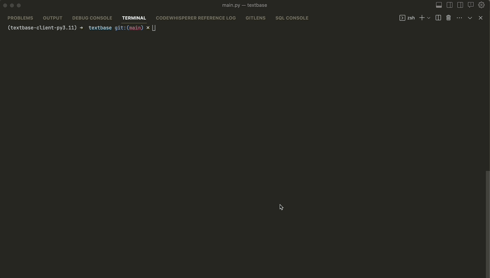

## Video 

https://github.com/00akash/textbase/assets/76787526/cc6dc8ab-322c-41e6-abfa-f458c12168c5

# My Contributions

# Health Buddy Chatbot
The Health Buddy Chatbot is an AI-powered chatbot designed to assist users with their health-related inquiries and needs. It provides a wide range of features, including health tips, medical condition information, and the ability to make emergency calls and order medicines.


## Features

- **Health Tips:** Get valuable health tips and advice on nutrition, exercise, and general wellness.
- **Medical Condition Information:** Learn about various medical conditions and access resources for further information.
- **Emergency Response:** Make emergency calls to specified contacts in critical situations.
- **Medicine Ordering:** Easily order medicines through the integrated medicine ordering system.
- **Ask Health Related Questions:** Explore all the features.


## Usage

1. Launch the chatbot application.
2. Type "General Health Inquiry" to start a conversation.
3. Follow the prompts and select options to utilize different features.

Just implement the `on_message` function in `main.py` and Textbase will take care of the rest :)

Since it is just Python you can use whatever models, libraries, vector databases and APIs you want.

Coming soon:
- [x] [PyPI package](https://pypi.org/project/textbase-client/)
- [x] Easy web deployment via [textbase deploy](/docs/deployment/deploy-from-cli)
- [ ] SMS integration
- [ ] Native integration of other models (Claude, Llama, ...)



## Installation
Make sure you have `python version >=3.9.0`, it's always good to follow the [docs](https://docs.textbase.ai/get-started/installation) 👈🏻
### 1. Through pip
```bash
pip install textbase-client
```

### 2. Local installation
Clone the repository and install the dependencies using [Poetry](https://python-poetry.org/) (you might have to [install Poetry](https://python-poetry.org/docs/#installation) first).

For proper details see [here]()

```bash
git clone https://github.com/cofactoryai/textbase
cd textbase
poetry shell
poetry install
```

## Start development server

> If you're using the default template, **remember to set the OpenAI API key** in `main.py`.

Run the following command:
- if installed locally
    ```bash
    poetry run python textbase/textbase_cli.py test
    ```
- if installed through pip
    ```bash
    textbase-client test
    ```
Response:
```bash
Path to the main.py file: examples/openai-bot/main.py # You can create a main.py by yourself and add that path here. NOTE: The path should not be in quotes
```
Now go to the link in blue color which is shown on the CLI and you will be able to chat with your bot!


### `Other commands have been mentioned in the documentaion website.` [Have a look](https://docs.textbase.ai/usage) 😃!

## Acknowledgments

- Thanks to the TextBase Mercor Titans Hackathon for inspiration and support.
- Special thanks to the open-source community for their valuable contributions.
